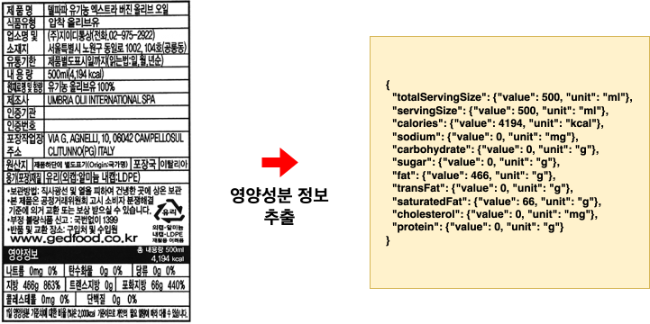
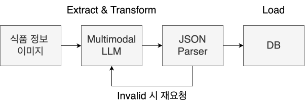

# Overview

  

# Workflow

  

# What is Food_Info_ETL?
Food_Info_ETL은 LLM 기반 식품 이미지 내 영양성분 정보 ETL 자동화 파이프라인 입니다.

LangChain을 사용하여 식품 이미지 로드 → LLM 기반 정보 추출 및 변환 → 결과 검증 → MongoDB 적재 과정으로 ETL 파이프라인을 구성하였습니다.

LLM은 Ollama를 활용해 이미지 입력이 가능한 모델들을 비교 분석하여 Qwen3.5-9b or Gemma4-e2b로 구성하였습니다.

